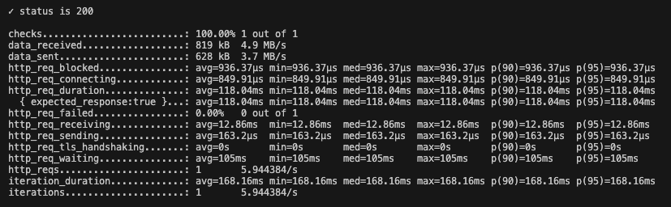
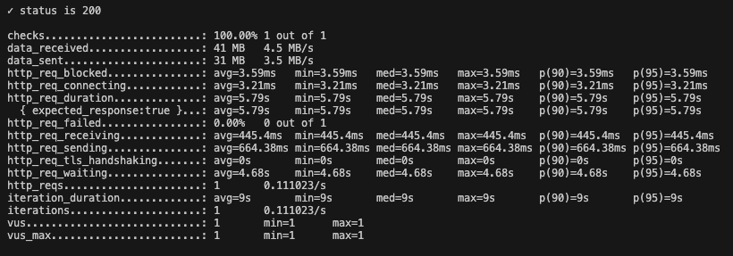

[](https://github.com/yasmindias/loan-simulator/blob/master/README.md)

# Loan Simulator #
This project performs a loan simulation and returns the payment conditions, based on the requested value, interest rate and payment term.

## Run Locally
### Requirements
- [Java 17](https://jdk.java.net/archive/) **(OpenJDK)**
- [Gradle](https://gradle.org/install/)

### Run Project
Run the command ```./gradlew bootRun``` to start the project.

It will provide the url ``http://localhost:8080`` for the API calls, see [Swagger](http://localhost:8080/swagger-ui/index.html) for requests examples.

### Run Tests

#### Unit Tests
To run tests locally run the command ```./gradlew clean test```.

#### Integration Tests
To run integration tests locally run the command ```./gradlew clean integrationTest```.

#### Performance Tests
### Requirements
- [Docker](https://www.docker.com/products/docker-desktop/)

To run our load test we use the tool [K6](https://grafana.com/docs/k6/latest/), running in a Docker container.
The test is configured to create 10000 different simulations, if you wish to change this number you should edit the const *NUMBER_OF_SIMULATIONS* in the `load_test.js` file.

Use the following commands to build and run the test.

```
docker build . -t dock-k6
docker run --add-host=host.docker.internal:host-gateway --rm dock-k6 run load_test.js
```

## Run on Container
### Requirements
- [Docker](https://www.docker.com/products/docker-desktop/)

## Request examples

### Success

**Request**

``POST /simulation``
```json
[
    {
        "totalValue": 66189,
        "birthDate": "1930-01-27",
        "paymentTerm": 40
    },
    {
        "totalValue": 13000,
        "birthDate": "1978-01-27",
        "paymentTerm": 38
    }
]
```

**Response**
```json
[
    {
        "totalAmount": 900178.00,
        "monthlyPayment": 22504.45,
        "totalInterestPaid": 833989.00
    },
    {
        "totalAmount": 84196.22,
        "monthlyPayment": 2215.69,
        "totalInterestPaid": 71196.22
    }
]
```

### Failure
**Request**

``POST /simulation``
```json
[
    {
        "totalValue": 66189,
        "birthDate": "2018-01-27",
        "paymentTerm": 40
    },
    {
        "totalValue": 90,
        "birthDate": "1978-01-27",
        "paymentTerm": 38
    },
    {
        "totalValue": 150,
        "birthDate": "1995-01-27",
        "paymentTerm": 1
    }
]
```

**Response**

```json
{
	"status": 400,
	"error": "Bad Request",
	"message": "Error on validation",
	"errors": [
		"simulate.request[1].totalValue: deve ser maior que ou igual à 100",
		"simulate.request[2].paymentTerm: deve ser maior que ou igual à 2",
		"simulate.request[0].birthDate: o cliente deve ser maior de idade"
	],
	"timestamp": "2025-01-30T10:59:25.478886-03:00"
}
```

## Documentation
- [Swagger](http://localhost:3000/swagger-ui/index.html)

## Solution
### Context
Create an API that receives a request with *n* amount of data and to each set of data returns a loan simulation.

### Decision and Justification
It was decided to implement a solution where the API endpoint receives an array with the data to be used in the simulations, each set of data is passed into a Coroutine to be validated and used in the simulation.
The service class runs the simulation and returns an object with the *total amount*, the *monthly payments* and the *total insterest* to be paid.

This approach guarantees that each data set will be processed in parallel, so the processing time will be minimal and making the system capable of dealing with a large amount of data..

### Consequence
To verify the API performance it was run 3 load tests, using the K6 tool running in a Docker container, with different quantities of data: 1.000, 10.000, 500.000.
These are the results:

**1.000 requests - Response time: 28.52ms**


**10.000 requests - Response time: 118.04ms**


**500.000 requests - Response time: 5.79s**
