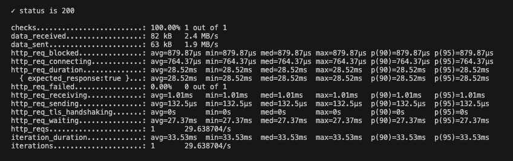
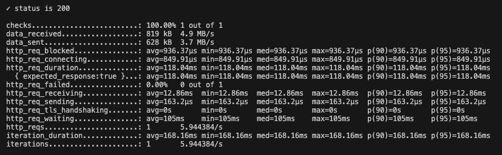
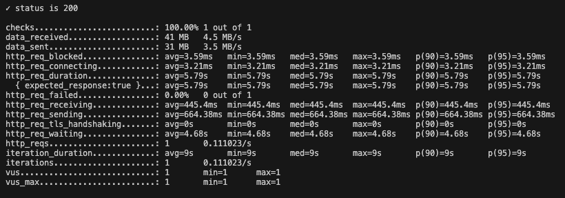

[](https://github.com/yasmindias/loan-simulator/blob/master/README.en.md)

# Simulador de Empréstimo #
Esse projeto roda uma simulação de empréstimo e retorna as condições de pagamento, baseadas no valor solicitado, taxa de juros e prazo de pagamento.

## Rodar locamente
### Pré-requisitos
- [Java 17](https://jdk.java.net/archive/) **(OpenJDK)**
- [Gradle](https://gradle.org/install/)

### Rodar o projeto
Rode o comando ```./gradlew bootRun``` pra iniciar o projeto.

As requisições devem ser feitas na url ``http://localhost:8080/``, seguindo os exemplos disponíveis no [Swagger](http://localhost:8080/swagger-ui/index.html)

### Rodar os testes
#### Testes Unitários
Para rodar os testes use o comando ```./gradlew clean test```.

#### Testes de Integração
Para rodar os testes de integração use o comando ```./gradlew clean integrationTest```.

#### Testes de Performance
### Pré-requisitos
- [Docker](https://www.docker.com/products/docker-desktop/)

Para executar os testes de carga usamos a ferramenta [K6](https://grafana.com/docs/k6/latest/), rodando dentro de um container Docker.
O teste está configurado para gerar 10000 simulações diferentes, caso deseje alterar esse número deve ser alterado a constante *NUMBER_OF_SIMULATIONS* no arquivo `load_test.js`

Use os seguintes comandos para buildar e rodar os testes:

```
docker build . -t dock-k6
docker run --add-host=host.docker.internal:host-gateway --rm dock-k6 run load_test.js
```

## Rodar em um Container Docker
### Pré-requisitos
- [Docker](https://www.docker.com/products/docker-desktop/)


## Exemplos de Requisição

### Sucesso

**Requisição**

``POST /simulation``
```json
[
    {
        "totalValue": 66189,
        "birthDate": "1930-01-27",
        "paymentTerm": 40
    },
    {
        "totalValue": 13000,
        "birthDate": "1978-01-27",
        "paymentTerm": 38
    }
]
```

**Resposta**
```json
[
    {
        "totalAmount": 900178.00,
        "monthlyPayment": 22504.45,
        "totalInterestPaid": 833989.00
    },
    {
        "totalAmount": 84196.22,
        "monthlyPayment": 2215.69,
        "totalInterestPaid": 71196.22
    }
]
```

### Falha
**Requisição**

``POST /simulation``
```json
[
    {
        "totalValue": 66189,
        "birthDate": "2018-01-27",
        "paymentTerm": 40
    },
    {
        "totalValue": 90,
        "birthDate": "1978-01-27",
        "paymentTerm": 38
    },
    {
        "totalValue": 150,
        "birthDate": "1995-01-27",
        "paymentTerm": 1
    }
]
```

**Resposta**

```json
{
	"status": 400,
	"error": "Bad Request",
	"message": "Error on validation",
	"errors": [
		"simulate.request[1].totalValue: deve ser maior que ou igual à 100",
		"simulate.request[2].paymentTerm: deve ser maior que ou igual à 2",
		"simulate.request[0].birthDate: o cliente deve ser maior de idade"
	],
	"timestamp": "2025-01-30T10:59:25.478886-03:00"
}
```

## Documentação
- [Swagger](http://localhost:8080/swagger-ui/index.html)

## Solução

### Contexto
Projetar uma API que recebe uma requisição com *n* dados e para cada conjunto de dados retorna uma simulação de empréstimo.

### Decisão e Justificativa
Decidi implementar uma solução onde o endpoint recebe um array com os dados a serem usados nas simulações, e cada conjunto de dados é repassado para uma Coroutine para ser validado e depois ser feita a simulação.
A classe de serviço então roda a simulação e retorna um objeto contendo o *valor total* a ser pago, o valor dos *pagamentos mensais* e o *total de juros* a ser pago.

Essa abordagem garante que os dados serão processados em paralelo, fazendo com que o tempo de processamento seja menor e possibilitando que o sistema lide com um número maior de dados.

### Consequência
Para verificar a performabilidade da API fizemos 3 testes de carga, utilizando a ferramenta K6 rodando em um container Docker, com diferentes quantidades de dados: 1.000, 10.000, 500.000.
Os resultados são

**1.000 requisições - Tempo de resposta: 28.52ms**


**10.000 requisições - Tempo de resposta: 118.04ms**


**500.000 requisições - Tempo de resposta: 5.79s**
